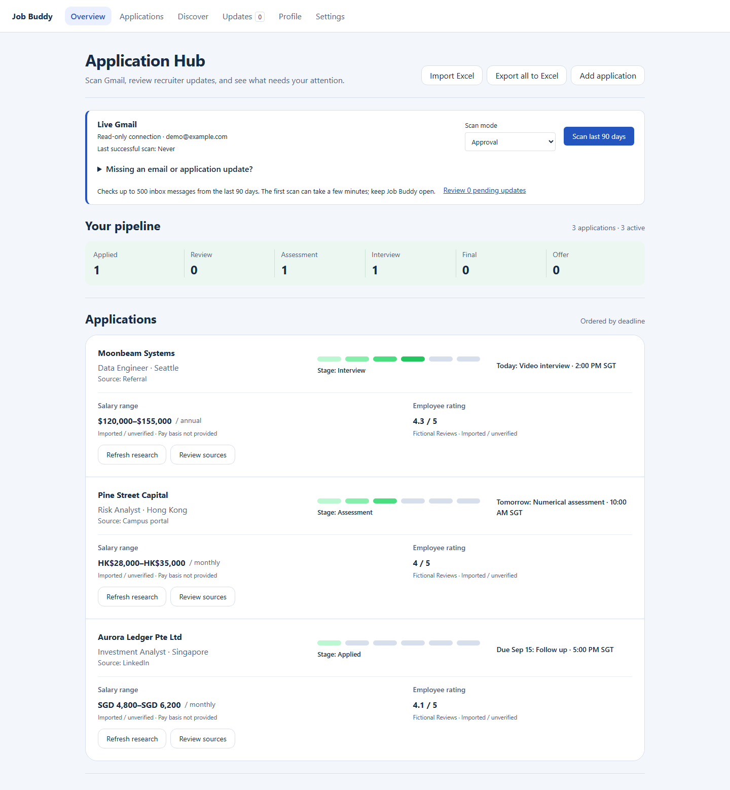

# Job Buddy

把求职申请、邮件更新和下一步行动集中在一个本地仪表板中。

[English](README.md) · [发布版本](https://github.com/yeebs1000/job-buddy/releases) · [路线图](ROADMAP.md)


*Application Hub · 示例数据。*

## 主要功能

- **Gmail 更新：**扫描申请邮件，审核建议后更新记录。
- **Application Hub：**一眼查看申请阶段、截止日期、备注和待办。
- **薪酬研究：**在申请旁查看薪酬区间、置信度和有来源的公司评分。
- **Excel 导入导出：**继续使用已有的申请记录。
- **本地资料：**保存个人资料，审核从简历中提取的信息。

申请记录保存在本机，Gmail 仅使用只读权限。

## 开始使用

Windows 源码测试版，需要 Node.js 24.19+（24.x）。

```powershell
git clone https://github.com/yeebs1000/job-buddy.git
cd job-buddy
npm.cmd ci
npm.cmd run dev
```

打开 [127.0.0.1:5173](http://127.0.0.1:5173)。按 [Gmail 配置指南](docs/gmail-maintainer-setup.md)在设置中连接邮箱；网页研究需要在设置中添加 Tavily 密钥。

## 路线图

| 下一步 | V2 |
| --- | --- |
| Windows 和 macOS 下载版 | Browser Buddy 自动填表 |
| 更简单的初始设置 | 更好的邮件提取与研究摘要 |

## 欢迎贡献

欢迎反馈问题、提出想法、完善文档或提交小范围改进。请先阅读[贡献指南](CONTRIBUTING.md)，并在示例中使用虚构数据。

[隐私](PRIVACY.md) · [安全](SECURITY.md) · [MIT License](LICENSE)
